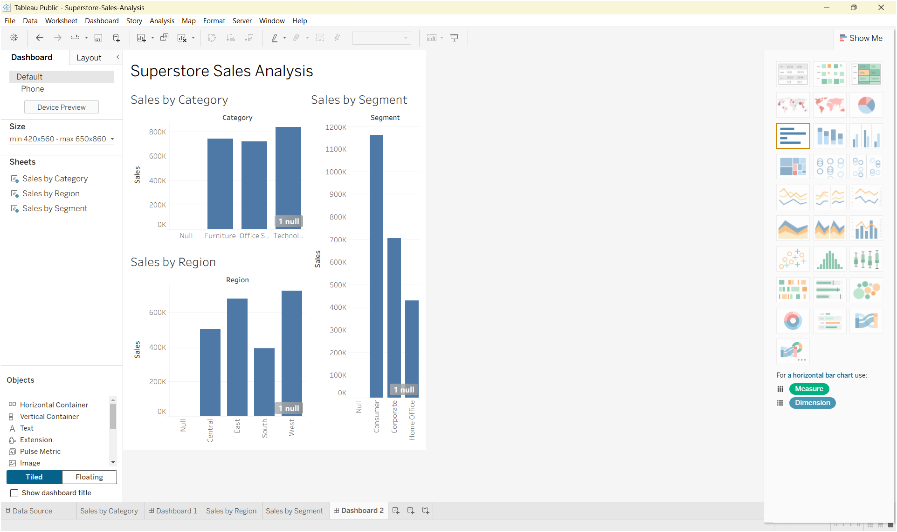

# Superstore Sales Analysis

## Objective

This project focuses on data visualization and storytelling using the Superstore sales dataset. The goal is to present sales information through clear visualizations and communicate meaningful business insights.

## Tools Used

- Tableau Public
- Superstore.csv

## Dashboard Visualizations

The dashboard includes:

- Sales by Category
- Sales by Region
- Sales by Segment
- Key Takeaways

## Dashboard Preview

## Key Takeaways

The dashboard provides a visual comparison of sales performance across different product categories, geographical regions, and customer segments. These comparisons help identify differences in sales distribution and provide a foundation for further business analysis.

## Files Included

- `Superstore.csv` — Dataset used for the analysis
- `Superstore-Sales-Analysis.twb` — Tableau workbook
- `Superstore-Sales-Dashboard.png` — Final dashboard screenshot

## Conclusion

The project demonstrates how Tableau can be used to transform sales data into an interactive visual report and communicate business information through charts and dashboard storytelling.
